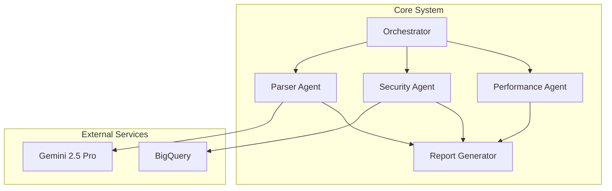

# Code Analyst Agent &nbsp;

A **production-ready** multi-agent system powered by **Gemini 2.5 Pro** for comprehensive analysis of large software codebases. Built with Google Cloud Platform integration, BigQuery analytics, and enterprise-grade security.

---

## 🚀 Features

* **Multi-Agent Architecture**: Orchestrated agents for parsing, security scanning, and performance profiling
* **AI-Powered Analysis**: Leverages Gemini 2.5 Pro for deep code understanding with large context windows
* **Enterprise Security**: Advanced vulnerability detection with CVE database integration and BigQuery analytics
* **Scalable**: Handles repositories up to 500,000 LOC with cloud-native deployment
* **Multiple Report Formats**: Generates reports in JSON, HTML, Markdown, PDF, and DOCX
* **Production Ready**: Complete CI/CD pipeline, Kubernetes/Cloud Run deployment, monitoring
* **Rich Web UI**: Modern, responsive interface for interactive analysis

## 📋 Requirements Met (PRD Compliance)

✅ **F1**: Codebase Ingestion (GitHub URL/local path)  
✅ **F2**: Orchestrator Agent with context management  
✅ **F3**: Parser Agent with AST/call graph analysis  
✅ **F4**: Security Agent with BigQuery/CVE integration  
✅ **F5**: Performance Agent with bottleneck detection  
✅ **F6**: Gemini 2.5 Pro integration  
✅ **F7**: Multi-format report generation  
✅ **F8**: CLI & Flask API interfaces  
✅ **F9**: Comprehensive logging & testing  

## 🤖 Architecture



**[View Full Architecture Documentation →](docs/architecture.md)**

Key components:
* **Orchestrator**: Coordinates multi-agent workflow
* **Parser Agent**: AST analysis and code structure mapping  
* **Security Agent**: CVE detection and vulnerability scanning
* **Performance Agent**: Bottleneck and complexity analysis
* **Report Generator**: Multi-format report generation
* **Gemini 2.5 Pro**: Advanced code understanding
* **BigQuery**: Security analytics and CVE database

## 🚦 Quick Start

### 1. Installation

```bash
# Clone the repository
git clone https://github.com/your-org/codebase-analysis.git
cd codebase-analysis

# Create virtual environment
python -m venv .venv
source .venv/bin/activate  # Windows: .venv\Scripts\activate

# Install in development mode
pip install -e .[dev]
```

### 2. Configuration

```bash
# Copy environment template
cp .env.example .env

# Edit .env with your credentials:
# GOOGLE_API_KEY=your_gemini_api_key
# NVD_API_KEY=your_nvd_api_key
# GOOGLE_CLOUD_PROJECT=your_gcp_project
```

### 3. CLI Usage

```bash
# Analyze a repository
codebase-analyze --repo https://github.com/user/repo --output analysis_report --formats json,html,pdf

# Local repository
codebase-analyze --repo ./my-project --output local_analysis --formats json,html,md
```

### 4. Web UI

```bash
# Start the Flask API
python -m codebase_analysis.api

# Open browser to http://localhost:8000
```

## 🔧 Configuration

### Environment Variables

| Variable | Purpose | Default | Required |
|----------|---------|---------|----------|
| `GOOGLE_API_KEY` | Gemini API access | - | Yes* |
| `GOOGLE_CLOUD_PROJECT` | GCP project for BigQuery | - | Yes* |
| `NVD_API_KEY` | CVE vulnerability data | - | Recommended |
| `LOG_LEVEL` | Logging verbosity | `INFO` | No |
| `LOG_FORMAT` | `rich` or `json` | `rich` | No |
| `REPORT_DIR` | Report output directory | `./reports` | No |
| `RATELIMIT_STORAGE_URL` | Redis for rate limiting | `memory://` | No |

*Either `GOOGLE_API_KEY` or `GOOGLE_CLOUD_PROJECT` required

### BigQuery Setup (Optional)

For enhanced vulnerability analysis:

1. Enable BigQuery API in your GCP project
2. Create datasets: `security_analytics`
3. Set `GOOGLE_CLOUD_PROJECT` in your `.env`
4. Configure service account with BigQuery permissions

## 🏢 Production Deployment

### Docker

```bash
# Build image
docker build -t codebase-analysis:latest .

# Run container
docker run -p 8000:8000 \
  -e GOOGLE_API_KEY=your_key \
  -e NVD_API_KEY=your_nvd_key \
  codebase-analysis:latest
```

### Google Cloud Run

```bash
# Deploy using provided configuration
gcloud run services replace cloud-run-config.yaml

# Or deploy with CLI
gcloud run deploy codebase-analysis \
  --image=gcr.io/PROJECT_ID/codebase-analysis:latest \
  --platform=managed \
  --region=us-central1 \
  --memory=2Gi \
  --cpu=2
```

### Kubernetes

```bash
# Apply Kubernetes manifests
kubectl apply -f k8s-deployment.yaml

# Configure secrets
kubectl create secret generic codebase-analysis-secrets \
  --from-literal=GOOGLE_API_KEY=your_key \
  --from-literal=NVD_API_KEY=your_nvd_key
```

## 🔒 Security Features

* **Vulnerability Detection**: 15+ security patterns, hardcoded secrets, insecure imports
* **CVE Integration**: Real-time vulnerability database lookups
* **BigQuery Analytics**: Advanced dependency risk analysis
* **Security Headers**: CSP, CSRF protection, rate limiting
* **Container Security**: Non-root user, read-only filesystem, minimal attack surface

## 📊 Performance

* **Scalability**: Handles repositories up to 500,000 LOC
* **Speed**: ~10 minutes for 100,000 LOC analysis
* **Memory**: 2GB RAM recommended for large codebases
* **Concurrency**: Multi-threaded processing with configurable workers

## 🧪 Testing

```bash
# Run all tests
pytest tests/ -v

# With coverage
pytest tests/ --cov=codebase_analysis --cov-report=html

# Security tests
bandit -r codebase_analysis/

# Performance tests
pytest tests/test_performance.py -v
```

## 📈 Monitoring & Observability

* **Health Checks**: `/healthz` endpoint for load balancer probes
* **Structured Logging**: JSON format compatible with Stackdriver
* **Metrics**: Request duration, error rates, analysis throughput
* **Alerting**: Integration with Google Cloud Monitoring

## 🔄 CI/CD Pipeline

The project includes a comprehensive GitHub Actions pipeline:

* **Testing**: Multi-Python version testing (3.9, 3.10, 3.11)
* **Security**: Automated security scanning with Bandit and Trivy
* **Building**: Docker image building and pushing to GCR
* **Deployment**: Automated staging and production deployment
* **Monitoring**: Continuous security monitoring

## 📚 API Reference

### CLI Commands

```bash
codebase-analyze [OPTIONS]

Options:
  --repo TEXT           GitHub URL or local path [required]
  --output TEXT         Report base path (without extension)
  --formats TEXT        Report formats: json,html,md,pdf,docx
  --clean/--no-clean    Clean up temporary directories
  --help                Show help message
```

### REST API Endpoints

#### `POST /analyze`

Analyze a repository and generate reports.

**Request:**

```json
{
  "repo_url": "https://github.com/user/repo",
  "output": "analysis",
  "formats": ["json", "html", "pdf"]
}
```

**Response:**

```json
{
  "results": {
    "parser_results": {...},
    "security_findings": {...},
    "performance_issues": {...}
  },
  "report_files": ["analysis.json", "analysis.html", "analysis.pdf"]
}
```

#### `GET /healthz`

Health check endpoint.

#### `GET /download/<filename>`

Download generated report files.

## 🤝 Contributing

1. Fork the repository
2. Create a feature branch: `git checkout -b feature/amazing-feature`
3. Make your changes and add tests
4. Run the test suite: `pytest tests/`
5. Commit your changes: `git commit -m 'Add amazing feature'`
6. Push to the branch: `git push origin feature/amazing-feature`
7. Open a Pull Request

## 📄 License

This project is licensed under the Apache License 2.0 - see the [LICENSE](LICENSE) file for details.

## 🆘 Support

* **Documentation**: See the `/docs` folder for detailed guides
* **Issues**: Report bugs on [GitHub Issues](https://github.com/your-org/codebase-analysis/issues)
* **Discussions**: Join our [GitHub Discussions](https://github.com/your-org/codebase-analysis/discussions)

---

**Enterprise Support**: For enterprise deployment, custom integrations, or commercial support, contact us at <support@your-company.com>

Built with ❤️ using Gemini 2.5 Pro and Google Cloud Platform
