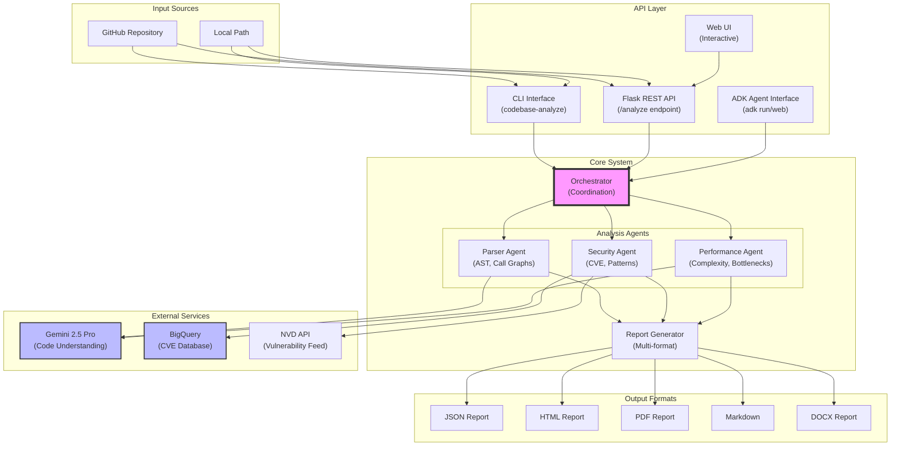

# Code Analyst Agent Architecture

## System Overview

The Code Analyst Agent is a production-ready multi-agent system that performs comprehensive analysis of software codebases using Google's Agent Development Kit (ADK), Gemini 2.5 Pro, and BigQuery.

## Architecture Diagram

## Component Descriptions

### Input Layer

- **GitHub Repository**: Remote repositories accessed via HTTPS/SSH
- **Local Path**: Local file system repositories

### API Layer

- **CLI Interface**: Command-line tool for batch processing
- **Flask REST API**: RESTful endpoints for programmatic access
- **Web UI**: Interactive browser-based interface
- **ADK Agent Interface**: Google ADK runtime compatibility

### Core System

#### Orchestrator

Central coordinator that:

- Manages agent lifecycle
- Distributes work to specialized agents
- Aggregates results from all agents
- Handles error recovery and retries

#### Analysis Agents

**Parser Agent**

- Builds Abstract Syntax Trees (AST)
- Generates call graphs and dependency maps
- Extracts code metrics and structure

**Security Agent**

- Detects hardcoded secrets and credentials
- Identifies insecure coding patterns
- Queries CVE databases for known vulnerabilities
- Analyzes dependency risks

**Performance Agent**

- Identifies algorithmic complexity issues
- Detects performance anti-patterns
- Analyzes resource usage patterns
- Flags potential bottlenecks

#### Report Generator

- Consolidates findings from all agents
- Generates reports in multiple formats
- Applies consistent formatting and branding
- Includes actionable recommendations

### External Services

**Gemini 2.5 Pro**

- Large language model for code understanding
- Provides contextual analysis and insights
- Identifies design patterns and architectural decisions

**BigQuery**

- Hosts vulnerability database
- Enables complex security analytics
- Provides historical trend analysis

**NVD API**

- Real-time CVE feed
- Official vulnerability severity scores
- Mitigation recommendations

## Data Flow

1. **Input Processing**: Repository URL or path is validated and cloned if needed
2. **Orchestration**: Orchestrator initializes agents with repository path
3. **Parallel Analysis**: Agents work concurrently, each focusing on their domain
4. **External Enrichment**: Agents query external services for additional context
5. **Result Aggregation**: Orchestrator collects and merges agent outputs
6. **Report Generation**: Unified reports created in requested formats
7. **Delivery**: Reports saved to disk or returned via API

## Security Considerations

- Non-root container execution
- Temporary repository cloning with cleanup
- API rate limiting and authentication
- Secure credential management via environment variables
- Input validation and sanitization

## Scalability Features

- Stateless design enables horizontal scaling
- Cloud Run auto-scaling based on load
- BigQuery handles large-scale analytics
- Configurable concurrency limits
- Efficient memory usage with streaming processing
